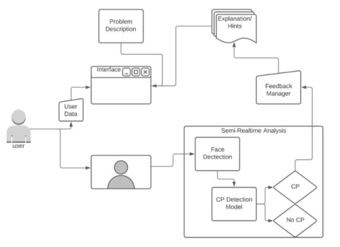
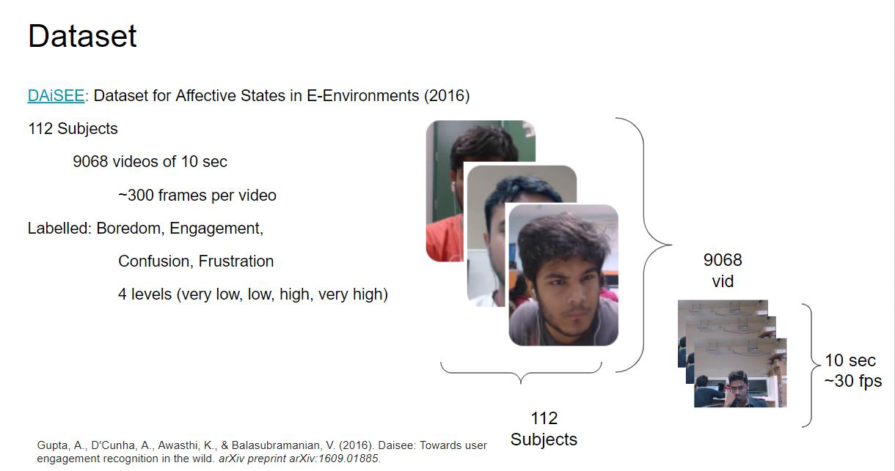

# Model Development with the DAiSEE Dataset for an Intelligent Tutoring System recognizing Comprehension Problems during Learning
This project is meant to develop an intelligent tutoring system monitoring the learning and comprehension process of 
complex material during e.g. online classes or e-learning environments. In this case, the intelligent tutoring system was 
testes on a language grammar learning task. A novel stimuli was presented to learn the basic Finnish plural in a short 
video. The learner must take a comprehension test directly after the explanation video, unless he or she showed signs of 
comprehension difficulties. In this case, the tutorial system suggests a new explanation in which the plural rules are 
shown again in summary.

# Model Development

### Dataset
The [DAiSEE](https://arxiv.org/abs/1609.01885) Dataset is a freely available dataset of multi-label video classification
 capturing engagement and emotional states (frustration, confusion and boredom) of students watching MOOCs.
 DAiSEE can be downloaded [here](https://people.iith.ac.in/vineethnb/resources/daisee/index.html) but can be also 
 directly loaded into Python via [deeplake](https://datasets.activeloop.ai/docs/ml/datasets/daisee-dataset/).

Download the dataset, create the folder 'data/raw' and put the dataset into that folder.  

 
  

### Data Extraction
Download the dataset and keep the given data structure.
Extract relevant facial parameters from the DAiSEE dataset with OpenFace with 'make_dataset.py'. The resulting CSV 
file will be saved in the same folder under the respective data set.

Make sure that OpenFace is installed correctly according to your operating system. 
E.g. for Windows see the [Wiki](https://github.com/TadasBaltrusaitis/OpenFace/wiki/Windows-Installation).

Run the following Python script:

    $ \model_development\data\make_dataset.py

### Data Preprocessing
All features are calculated based on Action Units, landmarks and other parameters provided by OpenFace. 
For more information see the project report. The resulting data file is saved as a single CSV file containing all data in 
the folder data\interim\\...set\calculated_features.

Run the following Python script:

    $ \model_development\features\feature_calculation.py

Since the label were set new th

    $ merge_labels2data.py

The calculated features need to be normalized and further data manipulation has to be done. Figures of all features will
be stored in 'model_development\preprocessing\figures\data_distribution\' that show the data distribution before and 
after data manipulation. 
The resulting data will be saved in the following folder: 'data\interim\...set\data_preprocessed\'

    $ data_preprocessing.py

Features are selected based on variance analysis, feature correlation or recursive feature elimination. 
Some plots such as feature importance plots are saved in the folder
'model_development\preprocessing\figures\feature_selection\'. 

The best features are saved in a list in 'Selected_Features.json' in the same folder.

    $ man_feature_selection.py

### Feature Selection

